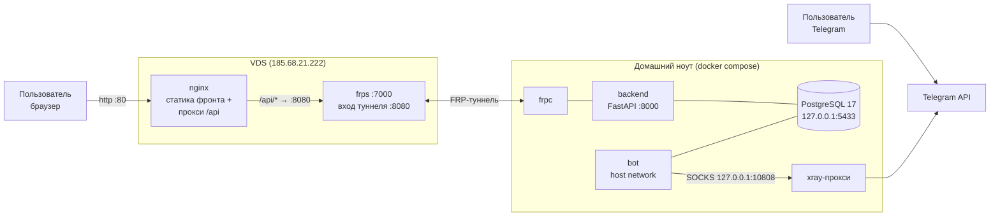
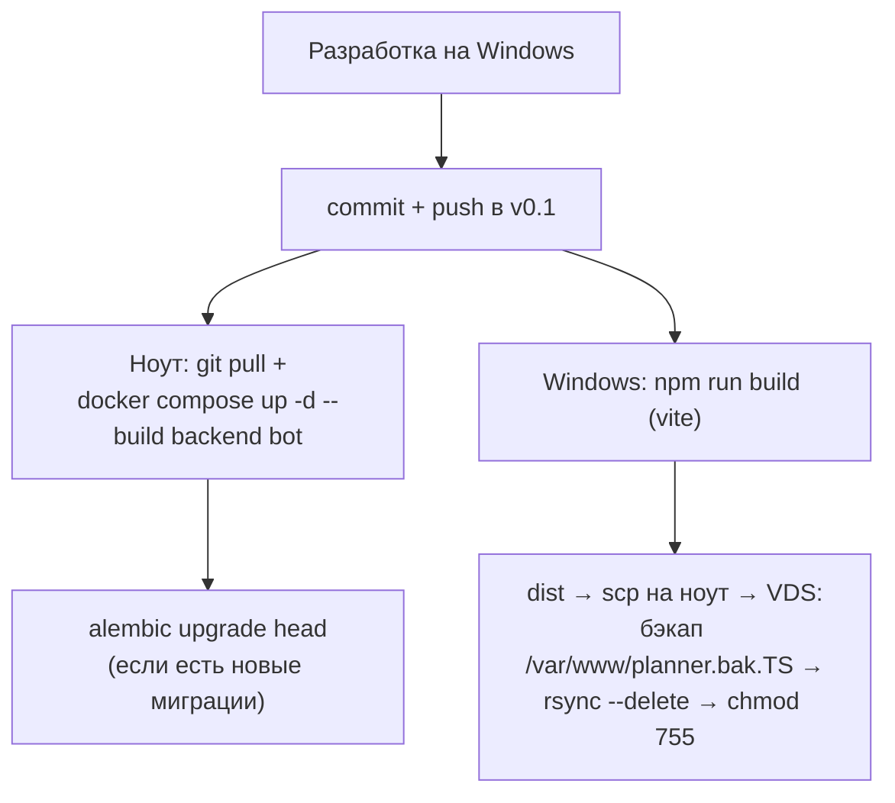

# Архитектура

Day Plan — персональный планировщик: план на день/неделю, цели, «Входящие»,
напоминания, статистика. Веб-приложение + Telegram-бот поверх общей БД.

## Компоненты

| Компонент | Стек | Где живёт |
|---|---|---|
| Frontend | React 19, Vite 7, antd, Tailwind, PWA (vite-plugin-pwa) | статика на VDS (nginx, `/var/www/planner`) |
| Backend | FastAPI, SQLAlchemy 2, Alembic, JWT-аутентификация | Docker-контейнер на домашнем ноуте |
| Telegram-бот | pyTelegramBotAPI (telebot), long polling + 2 фоновых потока | Docker-контейнер на ноуте (network_mode: host) |
| БД | PostgreSQL 17, 5 доменных схем | Docker-контейнер на ноуте, volume `postgres_data` |

Backend и бот собираются из одного образа (multi-stage `Dockerfile`),
различаются командой запуска. Бот ходит в БД напрямую через SQLAlchemy
(общие модели из `backend/db.py`), а не через REST API.

## Инфраструктура



Ключевые особенности:

- **FRP-туннель**: у ноута нет белого IP. `frpc` на ноуте пробрасывает
  `127.0.0.1:8000` на VDS как `:8080`; nginx на VDS проксирует `/api/*` туда.
- **Telegram заблокирован по IP в РФ** — бот ходит в Telegram API через
  SOCKS-прокси xray (`TELEGRAM_PROXY`, слушает только `127.0.0.1:10808`),
  поэтому контейнер бота работает в `network_mode: host`
  (см. `docker-compose.override.yml` на ноуте, в git его нет).
- **Время**: приложение хранит наивные локальные даты; всюду `TZ=Europe/Samara`
  (env контейнеров + tzdata в образе). UTC сдвинул бы напоминания на 4 часа.
- Порты Postgres (`127.0.0.1:5433`) и backend (`127.0.0.1:8000`) опубликованы
  только на loopback ноута — снаружи доступа нет, всё ходит через туннель.
- Автозапуск после отключения света: docker/frpc/xray включены в systemd,
  контейнеры с `restart: unless-stopped`, ноут сам включается при подаче питания.

## Запросы фронта к API

Фронт делает запросы на `/api/...` (см. `frontend/src/api/*.js`).
Префикс `/api` срезается прокси: в dev — vite dev server, в prod — nginx на VDS.
Роуты backend'а живут без префикса (`/auth/login`, `/reminders`, ...).
Авторизация — `Authorization: Bearer <JWT>`, токен в `localStorage`.

## Деплой

Прод трогаем **только по явной команде** (правило проекта).



- Перед любыми операциями с прод-БД — свежий проверенный дамп
  (`~/backup.sh` на ноуте: `pg_dump` из контейнера → gzip → scp на VDS `/root/backups/`).
- CI/CD пока нет — в плане (`planner/todo.md`, дни 4–7).
- `deploy.sh` в репо устарел (ссылается на снесённый systemd-стек) — не использовать.

## Структура репозитория

```
planner/
├── backend/          # FastAPI: main.py, db.py (модели), routers/, alembic/
│   ├── routers/      # эндпоинты по доменам (см. api.md)
│   ├── alembic/      # миграции (см. database.md)
│   └── tests/        # pytest, БД поднимается миграциями в conftest.py
├── bot/bot.py        # весь бот одним файлом
├── frontend/         # React SPA (src/pages, src/components, src/api)
├── proj_docs/        # эта документация
└── todo.md           # 10-дневный DevOps-план
docker-compose.yml    # postgres + backend + bot
Dockerfile            # общий образ backend/bot
```
