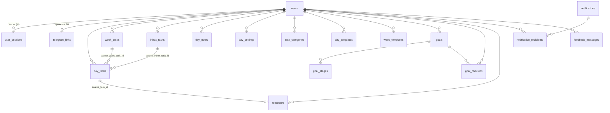

# База данных

PostgreSQL 17. Все таблицы разложены по пяти доменным схемам
(список — `SCHEMAS` в `backend/db.py`, единственный источник правды):

| Схема | Назначение | Таблицы |
|---|---|---|
| `auth` | пользователи и доступ | `users`, `user_sessions`, `telegram_links` |
| `planning` | планирование дня/недели | `day_tasks`, `day_notes`, `day_settings`, `week_tasks`, `inbox_tasks`, `task_categories`, `day_templates`, `week_templates` |
| `goals` | цели | `goals`, `goal_stages`, `goal_checkins` |
| `notifications` | уведомления и напоминания | `notifications`, `notification_recipients`, `reminders` |
| `feedback` | обратная связь | `feedback_messages` |

Все модели — в одном файле `backend/db.py`. Даты/время хранятся наивным
локальным временем сервера (`TZ=Europe/Samara`), кроме нескольких
`created_at` с `timezone=True`.

## ER-диаграмма

## Ключевые таблицы

### auth

- **users** — email/username (unique), `password_hash`, `email_verified` +
  `verification_token`, `role` (`user`/админские роли), `avatar`, `theme`,
  `default_day_start_time` (дефолт для новых `day_settings`); настройки
  напоминаний: `task_reminder_lead_min`, `reminder_repeat_min`,
  `reminder_repeat_max`, `goal_deadline_days` (см. [reminders.md](reminders.md)).
- **user_sessions** — по строке на выданный JWT: `jti` (unique), user_agent,
  ip, `last_seen_at`. Logout = удаление строки.
- **telegram_links** — `user_id` (unique) ↔ `chat_id` (unique); одноразовый
  `link_code` + `link_code_expires` для привязки (код показывает веб, вводится в боте).

### planning

- **day_tasks** — задача в плане дня: `day`, `title`, `start_time`,
  `duration_min`, `priority` (high/medium), `category` (ключ из
  `task_categories`), `status` (int), `subtasks` (JSON), `order_index`,
  `dismissed` (скрыта из «просроченных»), `remind_lead_min` (напомнить за N
  минут до начала, null = не напоминать). Ссылки на источник:
  `source_week_task_id`, `source_inbox_task_id`.
- **week_tasks** — задача недели: `start_date`/`end_date`, `important`,
  `task_type` (`normal`/повторяющиеся), `repeat_days` (JSON), `volume_value`.
- **inbox_tasks** — «Входящие»: быстрый захват идей. `assigned_at` ставится
  при назначении на день/неделю, `completed_at` — когда связанная day-задача
  выполнена; строка живёт, пока пользователь сам её не удалит.
- **day_settings** — время начала конкретного дня (сетка планировщика).
- **day_notes** — заметка на день (upsert по дате).
- **task_categories** — пользовательские категории (key, title, color, icon);
  дефолтный набор создаётся `bootstrap.ensure_default_categories_for_user`.
- **day_templates / week_templates** — шаблоны: снапшот задач в `tasks_json`,
  применяются на выбранный день/неделю.

### goals

- **goals** — `goal_type` (`one_time`/повторяющаяся), `target_date`,
  `repeat_unit`, `has_stages`, `schedule_mode`, `status`, `is_focus`
  (фокус-цель), `order_index`, `category_key`.
- **goal_stages** — этапы цели: `done`, `order_index`, `planned_date`.
- **goal_checkins** — отметки выполнения по датам (`check_date`, `done`) —
  для повторяющихся целей и отметок в плане дня/недели.

### notifications

- **notifications** + **notification_recipients** — in-app уведомления
  («колокольчик»): `audience_type` = single/group/all, у получателя
  `is_read`/`read_at`.
- **reminders** — личные напоминания: `text`, `remind_at` (наивное локальное),
  `sent`/`sent_at`; повторяемость `recur_every`/`recur_unit`, ответ
  `ack`/`ack_at`, `repeat_count`; `kind` (`manual`/`task`) + `source_task_id`
  (FK на day_tasks, ON DELETE CASCADE). Доставка — циклом в боте, подробно
  в [reminders.md](reminders.md).

### feedback

- **feedback_messages** — форма обратной связи: `category`, `feedback_type`,
  контакты, `screenshots` (JSON), `status` (new/...), ответ разработчика
  (`developer_reply`, `developer_replied_at`).

## Миграции (Alembic)

`backend/alembic/`, конфиг подхватывает `DATABASE_URL` из `.env`
(переменная окружения приоритетнее). `include_schemas=True`, фильтр
`include_name` ограничивает autogenerate пятью доменными схемами.

Цепочка:

| Ревизия | Что делает |
|---|---|
| `4adb412e452c` baseline | создаёт 5 схем и все таблицы/индексы с нуля |
| `1324ee61887c` cleanup dev drift | сносит мёртвую `notifications.notices` и старые имена индексов; **guard**: пропускает себя, если таблицы нет |
| `3907d6d53071` align prod (pgloader) | чинит наследие конвертации SQLite→PG (типы BIGINT→INTEGER, NOT NULL, имена индексов, FK); **guard**: выполняется только если `auth.users.id` — BIGINT |
| `1cbec591ba0e` reminders v2 | повторяемость/ack/`kind`+`source_task_id` у reminders, `day_tasks.remind_lead_min`, настройки напоминаний в users |

Guarded-миграции самопропускаются по runtime-инспекции, поэтому одна цепочка
работает и на чистой БД, и на исторических (dev на Windows, prod на ноуте).

Правила:
- новая миграция: `alembic revision --autogenerate -m "..."` → проверить diff руками → `alembic upgrade head`;
- `create_all` из кода удалён — схему меняет только Alembic;
- тесты поднимают схему миграциями (`tests/conftest.py`), т.е. каждая миграция гоняется в CI-контуре;
- на проде перед миграцией — свежий дамп (см. architecture.md → Деплой).
