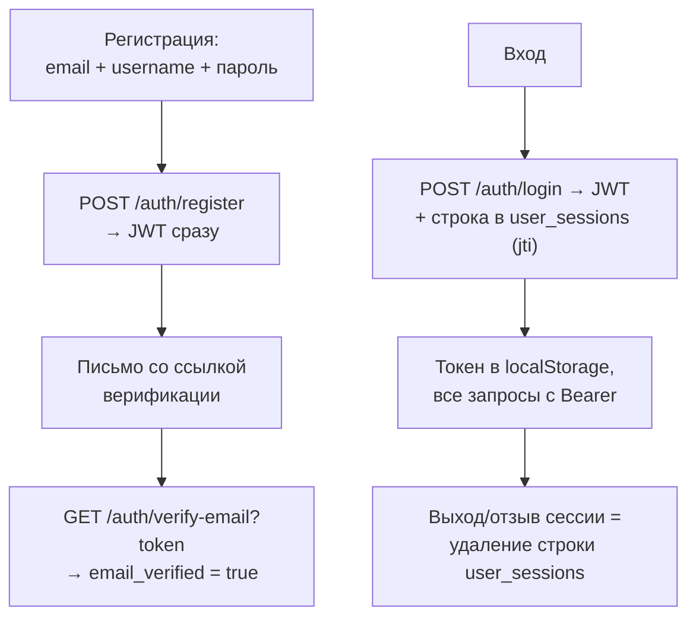
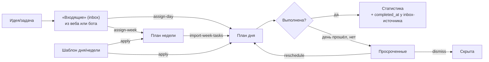
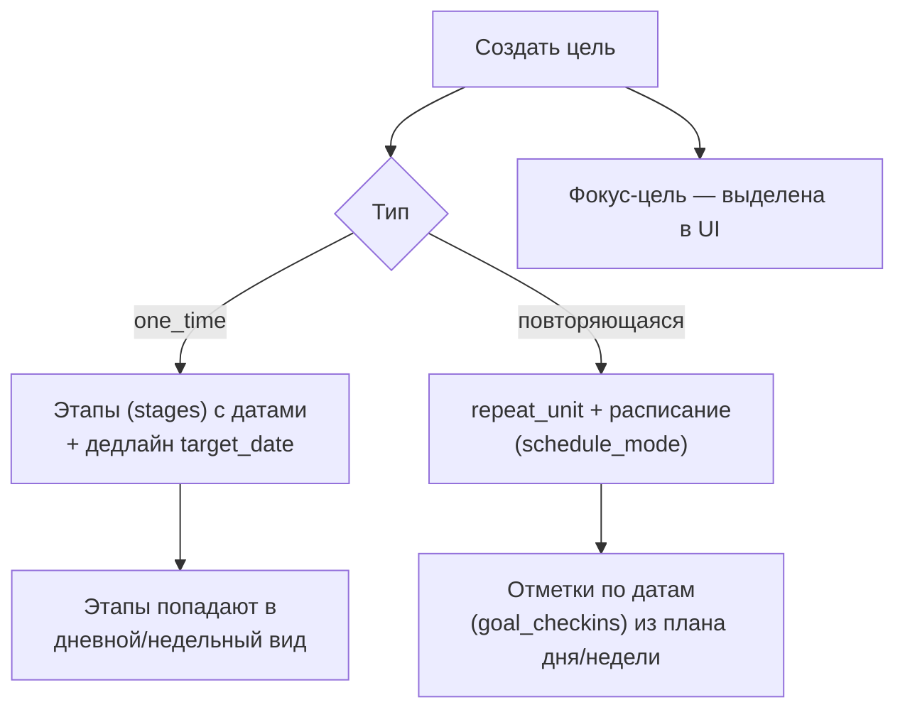
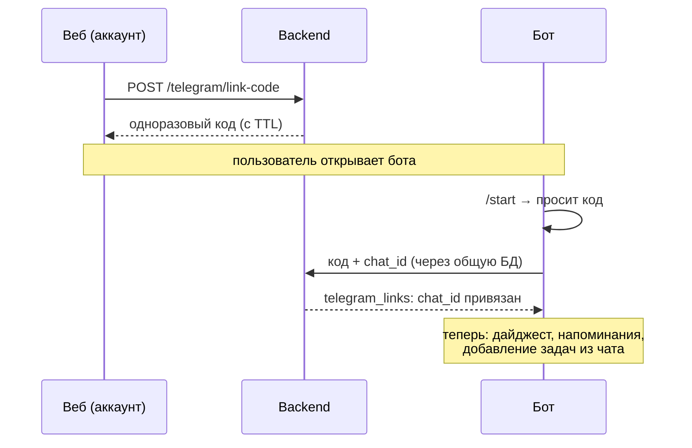
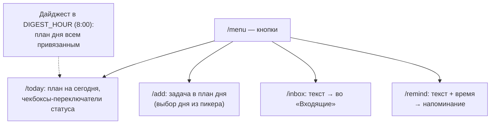
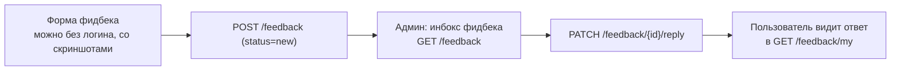

# Сценарии работы пользователя

Диаграммы основных пользовательских потоков. Детали по напоминаниям —
в [reminders.md](reminders.md).

## Регистрация и вход



## Планирование: Входящие → Неделя → День

Основной цикл работы с задачами:



- Задача дня помнит источник (`source_week_task_id` / `source_inbox_task_id`) —
  выполнение отражается на недельной задаче и во «Входящих».
- У дня есть настраиваемое время начала (сетка планировщика) и заметка.
- Категории задач — свои у каждого пользователя, дефолтный набор создаётся
  при регистрации.

## Цели



## Привязка Telegram



## Бот: ежедневная работа

Команды: `/menu`, `/today`, `/add`, `/remind`, `/reminders`, `/inbox`, `/help` +
reply-клавиатура с основными действиями.



## Напоминание: от создания до ответа

```mermaid
sequenceDiagram
    participant U as Пользователь
    participant W as Веб (колокольчик)
    participant B as Backend
    participant L as Бот: reminders loop (30 c)
    participant T as Telegram

    U->>W: текст + дата/время<br/>(+ повторяемость: каждые N дн/нед/мес)
    W->>B: POST /reminders
    Note over L: remind_at наступил, sent=false
    L->>B: Notification + Recipient (в колокольчик)
    L->>T: ⏰ сообщение: ✅ Сделано / 👀 Прочитано + снуз
    L->>B: sent=true, sent_at=now
    alt Ответ
        U->>T: ✅ Сделано / 👀 Прочитано
        T->>B: ack; done у задачного — задача выполнена;<br/>повторяющееся → на следующий цикл
    else Снуз (TG или веб-чипы +15м/+1ч/+1д)
        U->>T: «+10 мин … Завтра утром»
        T->>B: remind_at сдвинут, sent=false — сработает снова
    else Молчание
        Note over L: через reminder_repeat_min —<br/>🔔 повтор (до reminder_repeat_max раз)
    end
```

Задача дня с чекбоксом «напомнить за N минут» автоматически получает такое же
напоминание (двигается вместе с задачей); о дедлайнах целей бот предупреждает
за `goal_deadline_days` дней и в сам день. Всё настраивается в аккаунте,
детали — в [reminders.md](reminders.md).

## Обратная связь


